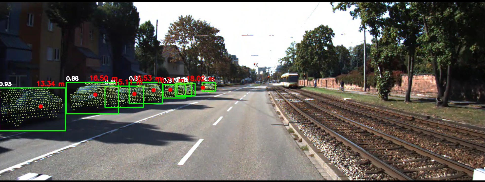

# Research on Multi-Modal Visual Data Fusion Techniques

## 📌 Overview
This project investigates techniques for fusing **2D RGB images** with **3D LiDAR point cloud data** to:
- Estimate distances from the camera to objects.
- Improve object detection performance.

We utilize **YOLOv8 (Ultralytics)** and **Open3D** to implement and compare different fusion strategies, and provide an **interactive demo using Streamlit**.

---

## 📂 Dataset
The original KITTI dataset is **not included** in the repository due to its large size. Please download manually from [KITTI Object Detection benchmark](https://www.cvlibs.net/datasets/kitti/eval_object.php?obj_benchmark=2d):

- **Left color images of object data set** (12 GB) → `image_2/` (RGB images)  
- **Velodyne point clouds** (29 GB) → `data_object_velodyne/`  
- **Camera calibration matrices** (16 MB) → `data_object_calib/`  
- **Training labels** (5 MB) → `data_object_label_2/`  

---
## 🔧 Main Pipeline
<p align="center">
  
</p>

1. **Project 3D Point Clouds onto 2D Images**  
   Using the calibration matrices between the camera and LiDAR, project the 3D point cloud onto the 2D image plane while preserving depth information.

2. **2D Object Detection**  
   Detect objects on RGB images using YOLOv8n.

3. **Crop Corresponding 3D Point Cloud**  
   Combine the 2D bounding boxes with the point cloud to crop the corresponding 3D region.

4. **Depth Estimation**  
   Calculate the depth (X, Y, Z coordinates) within the cropped 3D point cloud, calibrated to the camera coordinate system, to estimate the distance from the camera to each detected object.
---
## 🔧 Auxiliary Pipeline (Early Fusion Experiments)
<p align="center">
  
</p>
- Combine RGB and point cloud features using **Early Fusion**, then pass through two experimental branches:

  1. **Adapter Branch**  
     Generates fused images and achieves good results, demonstrating the potential of this approach.

  2. **Direct YOLOv8 Branch**  
     Combines features directly into YOLOv8 without modifying the loss function or adding extra convolutions. Results are less stable in this branch.
---

## Demo Video

[](https://youtu.be/jYok3vjIU8U)

## ⚙️ Installation


### 1. Clone the repository
```bash
git clone https://github.com/phonghoang30082004/Fusion_Data_Image_PointCloud
cd Research-on-techniques-that-combine-multiple-vision-data
```
### 2. Create and activate a virtual environment

Python ≥ 3.8
```bash
python -m venv venv
```

Windows
```bash
venv\Scripts\activate
```

macOS / Linux
```bash
source venv/bin/activate
```

### 3. Install dependencies
```bash
pip install --upgrade pip
pip install -r requirements.txt
```


